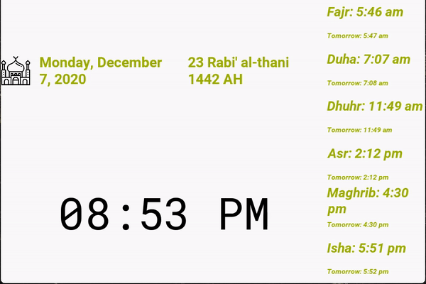
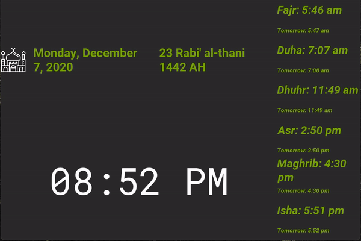

# Muezzin
Muezzin is a cross platform adhan app written in Python using the Kivy library.
It's targeted to use on a Raspberry Pi with a touch screen but it can run on other platforms as well.




## About
The application is written in Kivy using Python which means that the app can be compiled for multiple
platforms such as MacOS, Windows, Linux, Android and iOS.

The application is licensed with an MIT license so it's free for anyone to use or fork. So feel to modify for your use.

## Features
Primarily, the goal of the application is to display prayer times and play adhan at the prayer times.
The main screen of the application shows the current time, today's and tomorrow's prayer times,
the gregorian date and the hijri date. The app offers more than just playing adhan. 

The following features are present:

* Set alarm to wake up 10 minutes before Fajr
* Set alarm to wake up for tahhajud in the last third of the night
* Choose between Hanafi juristic method or Shafi/Hanbali/Maliki juristic method for prayer calculation
* Show the current weather
* Show the current moon phase
* Choose between dark mode (Sith mode) and light mode (Jedi mode)




## Running the app
Refer to the instructions [here](https://kivy.org/doc/stable/gettingstarted/installation.html)
to install Kivy on your respective platform. 

Make sure that Python 3 and pip is installed on your machine. Navigate to the root directory of your Muezzin app 
(i.e. the directory this file is in).

Install the virtualenv library

```bash
python3 -m pip install --upgrade pip setuptools virtualenv
```

Next, create a virtual environment

```bash
python3 -m virtualenv muezzin_env
```

Activate your virtual environment

```bash
source muezzin_env/bin/activate
```

Install all dependencies using pip

```bash
pip install -r requirements.txt
```

Run the app

```bash
python3 app/main.py
```

## Build Application
### Mac OS X
Follow instruction 1-5 on this [page](https://kivy.org/doc/stable/guide/packaging-osx.html).

Next, run the build_mac.sh bash script to build the app and the DMG.

```bash
sh build_mac.sh
```

### Raspbian
Install pyinstaller from source by running the following command:

```
git clone https://github.com/pyinstaller/pyinstaller
cd pyinstaller
python setup.py install
```

Then, build the bootloader from source in your pyinstaller directory as well:

```
cd bootloader
python waf all
```


Next, run the build_pi.sh bash script to build the app and create a tar file. 

```bash
sudo sh build_pi.sh
```

If you want to start your app, navigate to the `muezzin_app` folder, and run `muezzin/muezzin`

Run `sudo sh run_on_startup.sh` if you want to make the app run automatically on startup. This is really only useful you do not have a display connected to 
the Pi; otherwise you won't be able to see the app's GUI.

Disclaimer: you need to set the environment variable `KIVY_AUDIO` to the value `sdl2` to get the audio to work on the Raspberry Pi.
